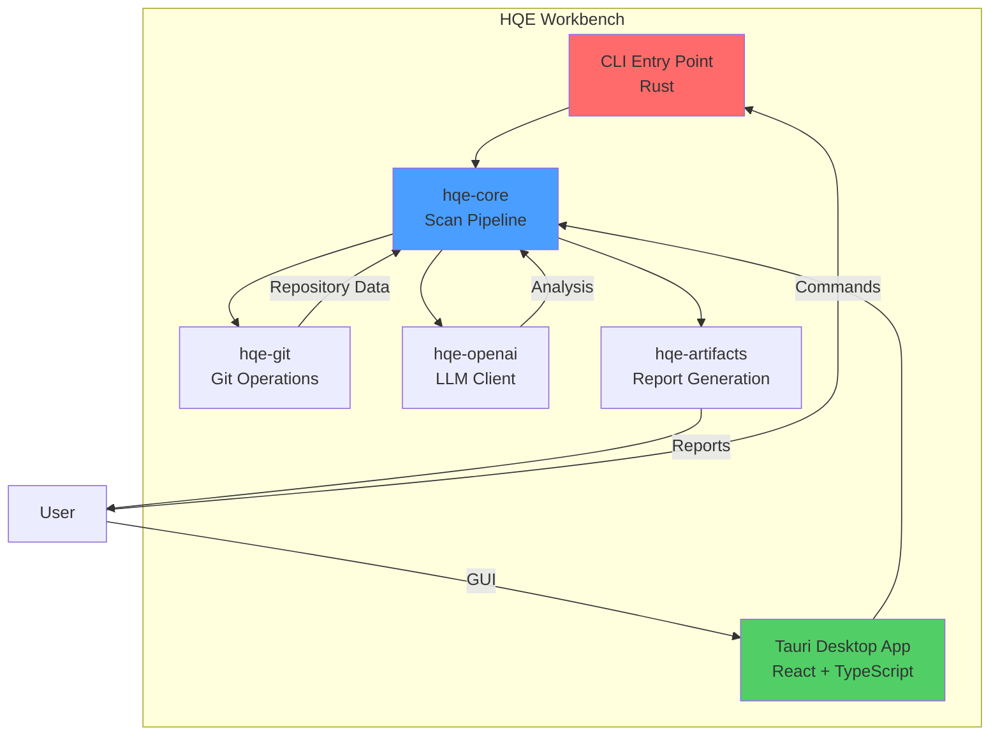

# HQE-Workbench

[](https://github.com/AbstergoSweden/hqe-workbench/actions/workflows/ci.yml)
[](https://github.com/AbstergoSweden/hqe-workbench/actions/workflows/security.yml)
[](LICENSE)
[](https://securityscorecards.dev/viewer/?uri=github.com/AbstergoSweden/hqe-workbench)

A local-first macOS desktop application and CLI tool for running the HQE (High Quality Engineering) Engineer Protocol. Automates codebase health auditing, security scanning, and technical leadership tasks using a combination of local heuristics and LLM-powered analysis.

## Table of Contents

- [Overview](#overview)
- [Architecture](#architecture)
- [Quick Start](#quick-start)
  - [Prerequisites](#prerequisites)
  - [Installation](#installation)
  - [Usage](#usage)
- [Development](#development)
  - [Building from Source](#building-from-source)
  - [Running Tests](#running-tests)
  - [Code Quality](#code-quality)
- [Documentation](#documentation)
- [Contributing](#contributing)
- [Security](#security)
- [License](#license)
- [Community](#community)

## Overview

HQE Workbench is a hybrid Rust/Python/TypeScript application that provides:

- **Repository Scanning**: Automated codebase health auditing
- **Secret Redaction**: Intelligent detection and removal of sensitive data
- **Local-Only Mode**: Privacy-first operation without external API calls
- **Report Generation**: Comprehensive Markdown and JSON reports
- **Multi-Runtime Support**: Python 3.11-3.13, Node 20/22

### File Structure

```text
hqe-workbench/
├── .github/             # CI/CD and Issue Templates
├── apps/
│   └── workbench/       # Desktop App (Tauri/React)
├── cli/
│   └── hqe/             # CLI Application Entry Point
├── crates/
│   ├── hqe-core/        # Scan Engine & Logic
│   ├── hqe-git/         # Git Operations
│   ├── hqe-mcp/         # Model Context Protocol
│   ├── hqe-openai/      # AI Provider Client
│   └── hqe-protocol/    # Schema & Type Defs
├── docs/                # Architecture & Guides
├── prompts/             # Expert Prompt Library
├── protocol/            # HQE Protocol Schemas
└── scripts/             # Build & Test Scripts
```

## Architecture



## Quick Start

### Prerequisites

- **macOS**: 12.0+ (Monterey)
- **Rust**: 1.75+
- **Python**: 3.11, 3.12, or 3.13
- **Node.js**: 20 or 22

### Installation

```bash
# Clone the repository
git clone https://github.com/AbstergoSweden/hqe-workbench.git
cd hqe-workbench

# Bootstrap the environment (macOS)
./scripts/bootstrap_macos.sh

# Build the CLI
cargo build --release -p hqe

# The binary will be available at target/release/hqe
```

### Usage

```bash
# Run a local-only scan
./target/release/hqe scan --repo /path/to/repo --local-only

# Generate a report
./target/release/hqe report --format markdown --output report.md

# Start the desktop application (development mode)
cd apps/workbench
npm run tauri:dev
```

## Development

### Building from Source

```bash
# Build all Rust crates
cargo build --workspace

# Build the desktop app
cd apps/workbench
npm install
npm run build

# Build Python components (if applicable)
cd python
pip install -e .
```

### Running Tests

```bash
# Rust tests
cargo test --workspace

# TypeScript tests
cd apps/workbench
npm test

# Python tests (if applicable)
pytest
```

### Code Quality

```bash
# Format code
cargo fmt --all
black .
npm run format

# Lint code
cargo clippy --workspace -- -D warnings
ruff check .
npm run lint

# Run all quality checks
npm run preflight  # If using the existing preflight script
```

## Documentation

- [Architecture Documentation](docs/ARCHITECTURE.md)
- [Development Guide](docs/DEVELOPMENT.md)
- [How-To Guide](docs/HOW_TO.md)
- [About the Project](ABOUT.md)
- [Legal & License](LEGAL.md)
- [API Reference](docs/API.md)
- [HQE Protocol v3](protocol/README.md)

## Contributing

We welcome contributions! Please see our [Contributing Guidelines](CONTRIBUTING.md) for details on:

- Reporting bugs and requesting features
- Development setup and workflow
- Code style and testing requirements
- Pull request process

Please note that this project is released with a [Code of Conduct](CODE_OF_CONDUCT.md). By participating, you agree to abide by its terms.

## Security

Security is a top priority for HQE Workbench. Please see our [Security Policy](SECURITY.md) for:

- Supported versions
- Vulnerability reporting process
- Security best practices

**To report a security vulnerability**, please email: <2-craze-headmen@icloud.com>

## License

This project is licensed under the MIT License - see the [LICENSE](LICENSE) file for details.

## Community

- **Maintainer**: AbstergoSweden
- **Community Profile**: <https://gravatar.com/swingstoccata3h>
- **Issues**: [GitHub Issues](https://github.com/AbstergoSweden/hqe-workbench/issues)
- **Discussions**: [GitHub Discussions](https://github.com/AbstergoSweden/hqe-workbench/discussions)
