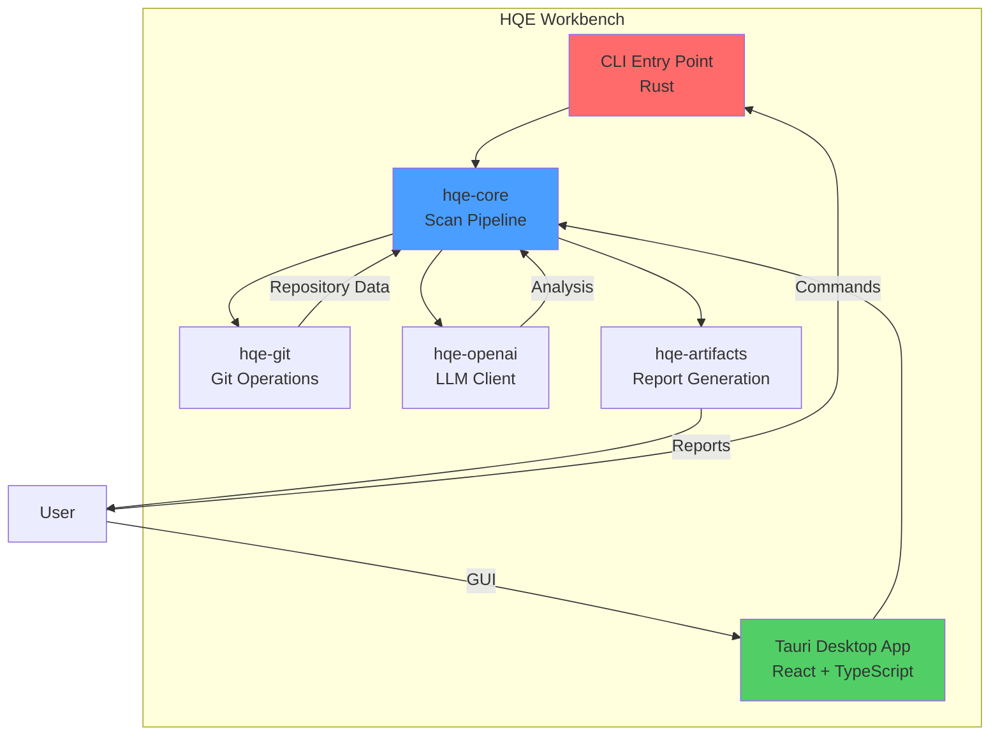

# HQE-Workbench


[](https://github.com/AbstergoSweden/HQE-Workbench/actions/workflows/ci.yml)
[](https://github.com/AbstergoSweden/HQE-Workbench/actions/workflows/security.yml)
[](https://securityscorecards.dev/viewer/?uri=github.com/AbstergoSweden/HQE-Workbench)
[](LICENSE)

A local-first macOS desktop application + CLI for running the HQE (High Quality Engineering) Engineer
Protocol. It automates codebase health auditing and produces actionable, evidence-backed TODOs using
a combination of local heuristics and (optional) LLM-powered analysis.

Key features:

- Local-only mode (no external API calls)
- Privacy-First Architecture: Local SQLite database for audit logs and semantic caching
- Optional LLM analysis via OpenAI-compatible chat completion APIs (text models only)
- Provider profiles + model discovery (desktop app)
- Artifact bundle output (`report.md`, `report.json`, `run-manifest.json`, logs)

## Table of Contents

- [Overview](#overview)
- [Architecture](#architecture)
- [Quick Start](#quick-start)
  - [Prerequisites](#prerequisites)
  - [Installation](#installation)
  - [Usage](#usage)
- [Development](#development)
- [Documentation](#documentation)
- [Contributing](#contributing)
- [Credits](#credits)
- [Security](#security)
- [License](#license)

## Overview

HQE Workbench is a hybrid Rust/Python/TypeScript application that provides:

- **Repository Scanning**: Automated codebase health auditing
- **Secret Redaction**: Intelligent detection and removal of sensitive data
- **Local-Only Mode**: Privacy-first operation without external API calls
- **Semantic Caching**: Locally stores LLM responses in SQLite to reduce costs and latency
- **Report Generation**: Comprehensive Markdown and JSON reports (plus run manifests and session logs)
- **Provider-agnostic LLM mode**: Any OpenAI-compatible chat completion API (text models only)

### File Structure

```text
hqe-workbench/
├── .github/             # CI/CD and Issue Templates
├── apps/
│   └── workbench/       # Desktop App (Tauri/React)
├── cli/
│   └── hqe/             # CLI Application Entry Point
├── crates/
│   ├── hqe-core/        # Scan Engine & Logic
│   ├── hqe-git/         # Git Operations
│   ├── hqe-mcp/         # Model Context Protocol
│   ├── hqe-openai/      # AI Provider Client
│   └── hqe-protocol/    # Schema & Type Defs
├── docs/                # Architecture & Guides
├── prompts/             # Expert Prompt Library
├── protocol/            # HQE Protocol Schemas
└── scripts/             # Build & Test Scripts
```

## Architecture

High-level architecture is documented in `docs/ARCHITECTURE.md`. The core idea:

- `hqe-core` runs the scan pipeline.
- `hqe-openai` provides an OpenAI-compatible chat client (used for optional LLM analysis and Thinktank prompts).
- `hqe-artifacts` writes `run-manifest.json`, `report.json`, and `report.md`.



## Quick Start

### Prerequisites

- **macOS**: 12.0+ (Monterey)
- **Rust**: 1.75+
- **Python**: 3.11+ (used for protocol validation)
- **Node.js**: 20+ (Workbench UI)

### Installation

```bash
# Clone the repository
git clone https://github.com/AbstergoSweden/HQE-Workbench.git
cd HQE-Workbench

# Bootstrap the environment (macOS)
./scripts/bootstrap_macos.sh

# Build the CLI
cargo build --release -p hqe

# The binary will be available at target/release/hqe
```

### Usage

```bash
# Run a local-only scan
./target/release/hqe scan /path/to/repo --local-only

# LLM-enabled scan (any OpenAI-compatible provider; text models only)
./target/release/hqe scan /path/to/repo --profile my-provider

# Disable local semantic caching
./target/release/hqe scan /path/to/repo --profile my-provider --no-cache

# Export an existing run to a folder
./target/release/hqe export RUN_ID --out ./hqe-exports
```

## Development

```bash
# Run the full local CI-equivalent checks (Rust + Workbench)
npm run preflight
```

## Documentation

- [Architecture](docs/ARCHITECTURE.md)
- [Development](docs/DEVELOPMENT.md)
- [How-To Guide](docs/HOW_TO.md)
- [About the Project](ABOUT.md)
- [Legal & License](LEGAL.md)
- [Privacy](PRIVACY.md)
- [Support](SUPPORT.md)
- [API Reference](docs/API.md)
- [HQE Protocol v3](protocol/README.md)

## Contributing

We welcome contributions! Please see our [Contributing Guidelines](CONTRIBUTING.md) for details on:

- Reporting bugs and requesting features
- Development setup and workflow
- Code style and testing requirements
- Pull request process

Please note that this project is released with a [Code of Conduct](CODE_OF_CONDUCT.md). By participating, you agree to abide by its terms.

## Credits

- Venice.ai integration is supported via its OpenAI-compatible API interface. See `CREDITS.md` for details.

## Security

Security is a top priority for HQE Workbench. Please see our [Security Policy](SECURITY.md) for:

- Supported versions
- Vulnerability reporting process
- Security best practices

**To report a security vulnerability**, please email: <2-craze-headmen@icloud.com>

## License

This project is licensed under the Apache License 2.0 - see the [LICENSE](LICENSE) file for details.
