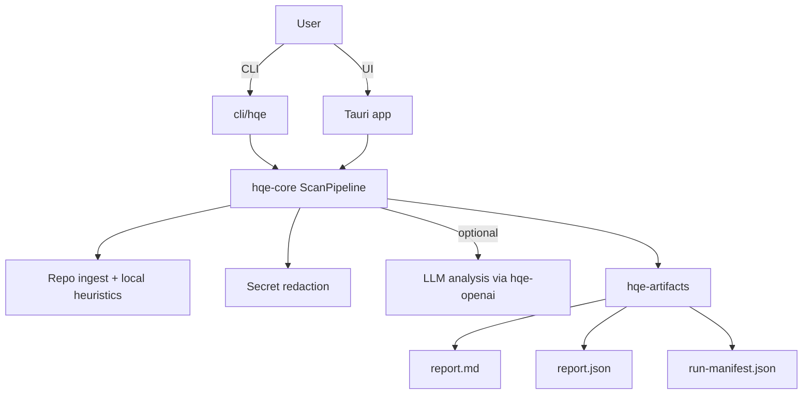

# HQE Workbench Architecture

This document is the canonical architecture entrypoint. For additional notes and iterations, see:

- `docs/architecture.md`
- `docs/architecture_v2.md`

## Overview

HQE Workbench is a local-first macOS desktop application built with Tauri v2, providing a native UI
for the HQE Engineer Protocol while sharing the same Rust scan pipeline as the CLI.

```text
┌─────────────────────────────────────────────────────────────┐
│                     HQE Workbench                           │
│  ┌──────────────────────────────────────────────────────┐  │
│  │              Tauri App (Rust + WebView)              │  │
│  │  ┌─────────────┐  ┌─────────────┐  ┌─────────────┐  │  │
│  │  │   React UI  │  │   Commands  │  │   State     │  │  │
│  │  │  (Frontend) │  │   (Bridge)  │  │  (Mutex)    │  │  │
│  │  └──────┬──────┘  └──────┬──────┘  └──────┬──────┘  │  │
│  └─────────┼────────────────┼────────────────┼─────────┘  │
│            │                │                │            │
│  ┌─────────┴────────────────┴────────────────┴─────────┐  │
│  │                    Rust Core                        │  │
│  │  ┌──────────┐ ┌──────────┐ ┌──────────┐ ┌────────┐ │  │
│  │  │hqe-core  │ │hqe-openai│ │ hqe-git  │ │hqe-art │ │  │
│  │  │(Pipeline)│ │(Provider)│ │ (GitOps) │ │(Export)│ │  │
│  │  └────┬─────┘ └────┬─────┘ └────┬─────┘ └───┬────┘ │  │
│  └───────┼────────────┼────────────┼───────────┼──────┘  │
└──────────┼────────────┼────────────┼───────────┼─────────┘
           │            │            │           │
    ┌──────┴──────┐    │     ┌──────┴──────┐    │
    │  Local FS   │    │     │   Git CLI   │    │
    └─────────────┘    │     └─────────────┘    │
                       │                        │
                  ┌────┴────┐            ┌─────┴─────┐
                  │Provider │            │Artifacts  │
                  │(OpenAI  │            │(MD/JSON)  │
                  │ schema) │            └───────────┘
                  └─────────┘
```

## Module Boundaries

### hqe-core

Purpose: scan pipeline orchestration and shared data models.

Responsibilities:

- Scan orchestration
- Repo walking + ingestion
- Redaction (secret detection + masking)
- Local-only analysis heuristics
- Producing a complete `HqeReport` + `RunManifest`

### hqe-openai

Purpose: OpenAI-compatible chat completion client used for text-model analysis and Thinktank prompt
execution. This is where provider discovery and compatibility layers live (Venice/OpenAI/local
schema servers).

Responsibilities:

- Provider profiles + keychain storage
- `/models` discovery + filtering to text models
- Request/response serialization (including JSON/schema response formats where supported)
- Retry logic and error classification

### hqe-git

Purpose: git operations wrapper.

Responsibilities:

- Repository detection
- Patch generation/apply flows (CLI)
- Shelling out to system `git`

### hqe-artifacts

Purpose: artifact and report generation.

Responsibilities:

- Writing `run-manifest.json`
- Writing `report.json`
- Writing `report.md`
- Writing `session-log.json` (+ redaction logs where applicable)

### hqe-mcp

Purpose: Model Context Protocol implementation.

Responsibilities:

- Serving the Thinktank prompt library
- Managing agent contexts and tools

### hqe-ingest

Purpose: Repository ingestion and file watching.

Responsibilities:

- Efficient file system walking
- Handling ignore patterns (gitignore, etc.)
- File change notifications

### hqe-flow

Purpose: Workflow execution and protocol orchestration.

Responsibilities:

- Executing multi-step agent flows
- Validating protocol invariants
- Orchestrating MCP tools

### hqe-vector

Purpose: Vector database operations (Future/Placeholder).

Responsibilities:

- Embedding storage and retrieval
- Semantic search capabilities

## Data Flow



## Security Considerations

- API keys are stored in macOS Keychain (not committed to disk in plaintext).
- In LLM-enabled scans, evidence is redacted before transmission.
- Local-only mode performs no external calls.

## Threading Model

- Rust code runs async on Tokio.
- UI is single-threaded JS/React, calling async Tauri commands.
- Git operations run as child processes.

